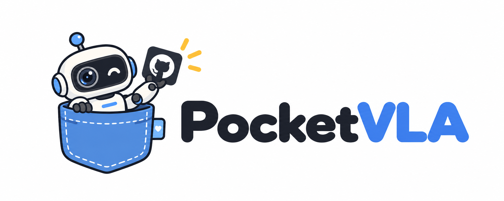
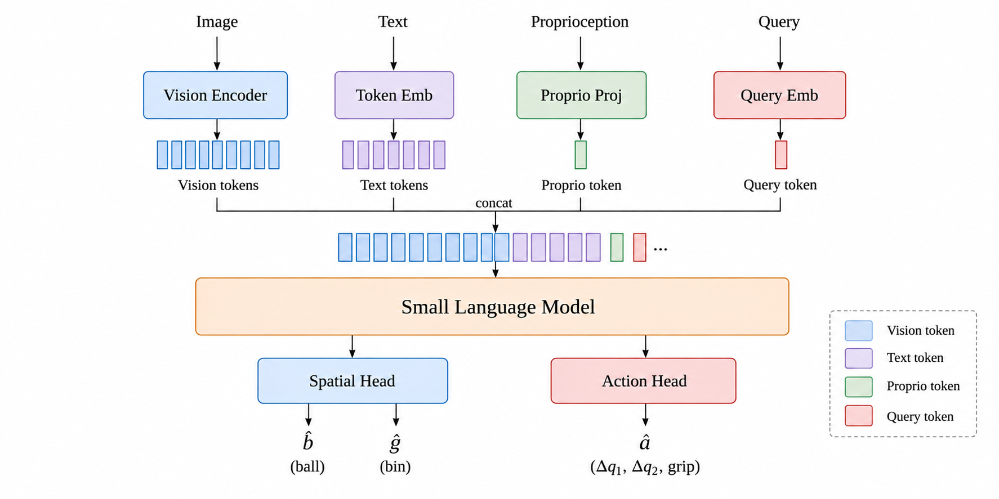
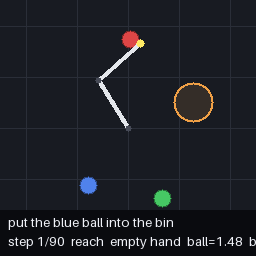
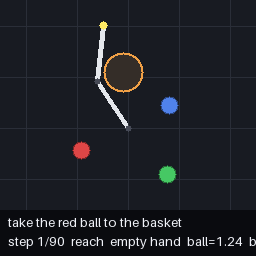
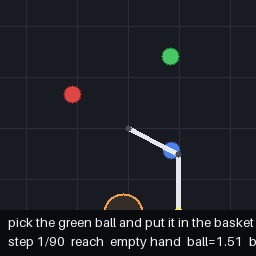
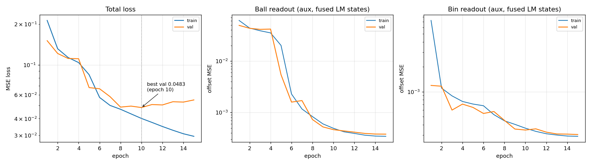

<p align="center"></p>
<h1 align="center">PocketVLA：Building a 3M VLA from Absolute Zero</h1>

<p align="center">
  简体中文 | <a href="docs/README_EN.md">English</a>
</p>


<p align="center">
  
  
  
  
</p>

## 项目介绍
🚀 **具身智能技术正迎来爆发式增长**，而 VLA（视觉-语言-动作模型）正是这场浪潮中核心的技术范式之一。本项目实现**从零开始搭建一个参数量仅 3M 的 VLA** ✨ —— 实现了极其轻量的场景，小到 💻 普通GPU 即可训练，快到 ⚡ 10分钟内跑完全流程。PocketVLA 由视觉编码器 👁️、语言模型主干 🧠 和动作头 🦾 三部分组成，与主流 VLA 结构相同；同时提供 **数据生成 → SFT 行为克隆 → GRPO 强化学习 → 推理评测 → OOD 泛化评测** 的端到端完整实现 🔄，可以以极小的成本来真正理解 VLA 算法的每一个环节，而不是停留在概念层面 💡。


**🎉本项目包含以下内容**：

- 🧪 **极轻量的仿真环境**（`pvla/sim/`）：纯 NumPy 实现的 2 连杆平面机械臂「抓取-放置」环境（正运动学、抓放语义、吸附判定）+ 64×64 观测渲染器与 GIF 回放导出，零重型依赖，CPU 即可运行。
- 🤖 **从零实现的 VLA 模型**（`pvla/model/vla.py`）：视觉编码器 + 语言模型主干 + 动作头的 VLM 早融合架构，完整兼容 HuggingFace `AutoModel` / `AutoTokenizer`。
- 🎯 **解析专家与数据生成**（`pvla/expert/` + `pvla/data/`）：闭式 IK + 双速比例控制 + 状态机专家，一键生成 SFT 示教、固定测试集、GRPO RL 场景集、OOD 测试集。
- 📚 **SFT 行为克隆训练**（`pvla/train.py`）：动作 MSE + 类平衡夹爪损失 + 辅助头监督。
- 🚀 **GRPO 强化学习**（`pvla/grpo.py`）：组采样闭环 rollout、优势加权回归、KL 锚防策略漂移。
- 📊 **推理闭环评测**（`pvla/evaluate.py`）：固定测试集单次扫描，逐场景回放 GIF、失败归因统计、分颜色成功率汇总图、专家 vs VLA 世界坐标轨迹对比。
- 🌗 **OOD 泛化评测**（`pvla/eval_ood.py` + `pvla/scenarios.py`）：检验模型领域外泛化能力。
- 📦 **开源模型权重与数据集**：预训练好的 SFT / GRPO checkpoint（HuggingFace 格式，[下载](#下载)）与全部 5 份训练/评测数据（约 65MB）。

## 模型结构


<p align="center"></p>

**设计要点**:

1. **标准 VLM 融合**: 视觉编码器输出vision token,
   经线性投影进入 LM 的 embedding 空间, 与文本 token、本体感知 token、可学习
   action-query token 拼接后一起过共享语言模型主干; 视觉与语言通过token级双向attention 充分交互。
2. **LM 输出直连动作头**: 动作头只读 action-query token 在 LM 输出中的隐状态,
   经 MLP + tanh 解码为动作 —— LM 隐层是动作通路的唯一输入, 视觉/语言/本体感知, 全部经由融合主干影响动作。
3. **辅助头**: 从融合后的 vision token 隐状态出发, 两个独立的轻量读出头 (球 / 筐) 各自以
   Conv + 注意力加权 8×8 网格中心输出球/筐的世界坐标。两者只提供深监督辅助损失与可解释性
   (不在动作通路上), 可由 `use_aux_heads: false` 一键关闭 —— **它对成功率的影响有多大？**
   见下方 [消融实验](#消融实验)。
4. **类平衡损失**: 夹爪按 (持球状态 × 标签) 4 组逆频率加权, 球偏移回归按归一化距离 4 桶加权。
  
## 下游任务: 2D Grab

<p align="center">
  
  
  
</p>

本体是一条 **2 连杆平面机械臂**，在俯视 2D 场景中执行语言引导的「抓取-放置」闭环任务，每个要素定义如下：

| 要素 | 定义 |
|:---:|---|
| 🔵 **场景** | 红 / 绿 / 蓝 3 个球 + 1 个收纳筐，位置每回合随机 |
| 💬 **指令** | 自然语言，如图中的 `put the blue ball into the bin` |
| 👁️ **观测** | 64×64×3 俯视图（含筐，不标记目标）+ 指令 token + 本体感知 `(q1, q2, ee_x, ee_y, 夹爪, 持球)` |
| 🦾 **动作** | `(Δq1, Δq2, grip)` 关节增量（限幅 `±0.15 rad`）；`grip > 0` 闭合 / `≤ 0` 张开 |
| 🤏 **抓取** | 闭合夹爪时末端距球心 `< 0.09` 即吸附（任何颜色的球都可抓，抓错需自行恢复） |
| 🧺 **放置** | 已松爪且球**完整落在筐内** → 成功 ✅；每回合最多 `90` 步 |

**任务难点：** 三个球的外观仅颜色不同，必须真正**理解指令中的颜色词**，从图像中定位对应的球；进入放置阶段后，还要再从图像中定位收纳筐。从**听懂语言**到**看见目标**再到**协调手臂完成动作**，这是VLA的浓缩体现。


## 环境准备

```bash
# Create and activate a conda environment
conda create -n pocketvla python=3.10 -y
conda activate pocketvla

# Install dependencies
pip install -r requirements.txt
```

## 快速开始

```bash
# Run the full pipeline
bash scripts/run_all.sh
```

或分步运行:

```bash
# 0. Dataset generation: train/val/test/grpo/ood_test in one shot (built-in defaults)
python3 -m pvla collect

# 1. Stage 1: SFT behavior cloning -> outputs_sft_3m/train/
python3 -m pvla train --config configs/sft_3m.yaml

# 2. Closed-loop eval on the fixed test set (GIFs + failure attribution + figures) -> outputs_sft_3m/eval/
python3 -m pvla evaluate --config configs/sft_3m.yaml

# 3. Stage 2: GRPO RL, fine-tunes the SFT checkpoint (full test-set eval runs automatically afterwards)
python3 -m pvla grpo --config configs/grpo_3m.yaml

# 4. OOD generalization eval (unseen distractor)
python3 -m pvla.eval_ood --config configs/sft_3m.yaml
python3 -m pvla.eval_ood -c configs/sft_3m.yaml --ckpt outputs_grpo_3m/pocketvla-3m-grpo
```

## 下载

### 预训练模型

各模型均为 HuggingFace 格式, 在仓库根目录先 `import pvla.model` 注册自定义类, 即可用
`AutoModel.from_pretrained(..., trust_remote_code=True)` 加载:

<table>
  <tr><th>模型</th><th>参数量</th><th>阶段</th><th>闭环成功率</th><th>下载</th></tr>
  <tr><td>pocketvla-3m-sft-2d-grab</td><td>3.02M</td><td>SFT</td><td>74.2%</td><td><a href="https://huggingface.co/penpenzh/pocketvla-3m-sft-2d-grab">🤗 HuggingFace</a></td></tr>
  <tr><td>pocketvla-3m-grpo-2d-grab</td><td>3.02M</td><td>SFT + GRPO</td><td><strong>80.2%</strong></td><td><a href="https://huggingface.co/penpenzh/pocketvla-3m-grpo-2d-grab">🤗 HuggingFace</a></td></tr>
</table>

### 数据集

全部数据由仿真器在线生成 (详见 [数据集生成](#数据集生成)), 也可直接下载:

<table>
  <tr><th>文件</th><th>规模</th><th>下载</th></tr>
  <tr><td><code>train.npz</code></td><td>7000 回合 / 184,364 样本</td><td><a href="https://huggingface.co/datasets/penpenzh/pocketvla-dataset-2D-grab">🤗 HuggingFace</a></td></tr>
  <tr><td><code>val.npz</code></td><td>3000 回合 / 79,150 样本</td><td><a href="https://huggingface.co/datasets/penpenzh/pocketvla-dataset-2D-grab">🤗 HuggingFace</a></td></tr>
  <tr><td><code>test.npz</code></td><td>500 场景</td><td><a href="https://huggingface.co/datasets/penpenzh/pocketvla-dataset-2D-grab">🤗 HuggingFace</a></td></tr>
  <tr><td><code>grpo.npz</code></td><td>3000 场景</td><td><a href="https://huggingface.co/datasets/penpenzh/pocketvla-dataset-2D-grab">🤗 HuggingFace</a></td></tr>
  <tr><td><code>ood_test.npz</code></td><td>300 场景</td><td><a href="https://huggingface.co/datasets/penpenzh/pocketvla-dataset-2D-grab">🤗 HuggingFace</a></td></tr>
</table>

### 快速推理示例

下载模型后, 即可用 HuggingFace 标准接口加载并推理 —— 输入一张 64×64 俯视图 + 一条
自然语言指令 + 6 维本体感知, 输出 3 维动作 `(Δq1, Δq2, grip)` (关节弧度增量 + 夹爪开合):

```python
import pvla.model  # register PocketVLA with AutoModel/AutoTokenizer (run from repo root)
import torch
from transformers import AutoModel, AutoTokenizer

ckpt = "penpenzh/pocketvla-3m-grpo-2d-grab"   # HF repo id, or a local dir like outputs_grpo_3m/pocketvla-3m-grpo
model = AutoModel.from_pretrained(ckpt, trust_remote_code=True).eval()
tok = AutoTokenizer.from_pretrained(ckpt, trust_remote_code=True)

# --- inputs: image / instruction / proprioception ---
image = torch.rand(1, 3, 64, 64)          # (1, 3, 64, 64) top-down view in [0, 1]
L = model.config.lang_len                 # instruction length (10)
enc = tok("put the green ball into the bin", padding="max_length", truncation=True, max_length=L)
tokens = torch.tensor([enc["input_ids"]]) # (1, L), zero-padded / truncated
pad = tokens != 0                         # padding masked out of attention
proprio = torch.tensor([[0.5, -0.3, 0.2, 0.4, 0.0, 0.0]])
# (q1/pi, q2/pi, ee_x/1.1, ee_y/1.1, gripper, holding)

# --- forward ---
with torch.no_grad():
    action, ball_off, bin_off = model(image, tokens, pad, proprio)

print("action (dq1, dq2, grip):", [round(x, 3) for x in action[0].tolist()])
# e.g. [0.082, -0.031, -1.0]: joint deltas in rad; grip > 0 closes, <= 0 opens
print("aux readout (ball offset, bin offset):",
      [round(x, 3) for x in ball_off[0].tolist()],
      [round(x, 3) for x in bin_off[0].tolist()])
```

> 💡 加载本地 checkpoint 目录 (如 `outputs_grpo_3m_pat/pocketvla-3m-grpo`) 同样适用;
> `ball_off / bin_off` 是辅助读出头输出的球/筐相对末端偏移 (归一化坐标), 仅用于可视化
> ; 拿到动作后可交给仿真环境闭环执行: `obs, _, done, info = env.step(action[0].numpy())`, 90 步内球入筐即成功。

## 主实验

### 数据集生成

全部数据由仿真器在线生成, 不依赖任何外部数据集:
`python3 -m pvla collect` 

**生成原理**

- **示教数据** (`train/val.npz`): 2 连杆平面臂有一个解析解 —— 闭式逆运动学 (IK, 固定
  肘下枝) 把目标世界坐标直接解算成关节角, 配合双速率比例控制与夹爪状态机 (未持球→抓指令球 / 持对球→送筐 / 持错球→先松爪恢复)构成一个成功率 100% 的特权专家; 每步记录 `(观测, 指令 token, 本体感知, 专家动作)`四元组, 关节动作归一化到 [-1,1], 并附带球/筐相对末端的偏移量作为辅助监督标签,动作加 σ=0.002 rad 微小噪声增加示教多样性。
- **场景集** (`test/grpo/ood_test.npz`): 每条只存一个初始场景
  `(球位置, 筐位置, 初始关节, 指令)` —— 评测/RL 时由环境精确重放该初始状态,
  策略自己闭环执行。


<table>
  <tr><th>文件</th><th>规模</th></tr>
  <tr><td><code>train.npz</code></td><td>7000 回合 / 184,364 样本</td><td></td></tr>
  <tr><td><code>val.npz</code></td><td>3000 回合 / 79,150 样本</td><td></td></tr>
  <tr><td><code>test.npz</code></td><td>500 场景</td><td></td></tr>
  <tr><td><code>grpo.npz</code></td><td>3000 场景</td><td></td></tr>
  <tr><td><code>ood_test.npz</code></td><td>300 场景</td><td></td></tr>
</table>

### 阶段 1 — SFT

**行为克隆损失** :

```
L = MSE(Δq1, Δq2)                    # joint action regression
  + 0.3 · w_grip · MSE(grip)         # class-balanced grip loss (action_grip_weight)
  + 1.0 · w_ball · MSE(ball_off)     # aux: commanded-ball offset (aux_target_weight)
  + 1.0 · MSE(bin_off)               # aux: bin offset (aux_bin_weight)
```

- `w_grip`: 夹爪标签按 **(持球状态 × 标签) 4 组**逆频率加权 (√频率、均值归一) —— 闭合/释放是少数临界样本,
  不加权会退化为「永远张开 / 永远闭合」的退化解
- `w_ball`: 球偏移按归一化距离 **4 个分桶** (0.08 / 0.2 / 0.5 / 1.6) 逆频率加权 —— 否则小偏移样本主导,
  远距离视觉定位被拖垮; 两处类平衡均可由 `balanced_losses: false` 一键关闭做消融
- checkpoint 选点: `ctrl = val_dq_mse + val_tgt_err + val_bin_err` (夹爪项方差大, 不参与选点);
  每次 ctrl 创新低即保存 HF 格式 checkpoint 到 `train.output_dir/pocketvla-<size>/`
- 两个空间读出头 (球 / 筐) 的偏移误差作为**深监督**辅助损失 (不在动作通路上), 训练曲线按
  「总损失 / 球读出头 / 筐读出头」三面板 (对数轴) 自动绘制, 并标注 best-val 选点:

<p align="center"></p>

### 阶段 2 — GRPO 强化学习 (独立阶段) 

每次迭代在 `steps_per_domain` (默认 20) 个域内
场景上各采样 G 个组员闭环玩完整局 (仅 2 个关节维加 σ=0.03 的高斯探索噪声, grip 保持离散),
按结局算奖励 (成功 +1.0 主导 + 更快 +0.1 + 抓对 +0.2 + 落点距离惩罚 −0.1 + 抓错 −0.3),
组内归一化为优势; 若组内优势方差为零则跳过, 否则仅对优势为正的成员做**优势加权回归**
(目标是去噪后的策略均值, 从不学习坏成员的噪声动作), 并叠加 **KL 锚** (
输出平方距离形式 ‖μ_θ − μ_SFT‖², 使策略不漂离 SFT) 。
yaml 顶层 `grpo:` 节控制全部参数; 平均组奖励创新高时保存 checkpoint, 连续 `early_stop`
次无提升早停 (3m yaml 设 20)。训练结束后自动在 500 场景测试集上**完整评测平均组奖励最优**的 GRPO checkpoint(而非最后一步策略), 随机抽 `gifs` (30) 个场景导出回放 GIF 到 `outputs_grpo_<size>/eval/case/`。

### 实验结果

在固定 500 场景测试集上的闭环评测结果 (同一测试集严格可比; pat 为相同配置的独立重复
实验, 用于评估训练随机性的影响):

<table>
  <tr><th>模型</th><th>阶段</th><th>闭环成功率</th><th>抓对球率</th><th>平均落点距离</th><th>成功回合平均步数</th></tr>
  <tr><td>pocketvla-3m-sft-2d-grab</td><td>SFT</td><td>74.2%</td><td>79.0%</td><td>0.251</td><td>30.8</td></tr>
  <tr><td>pocketvla-3m-grpo-2d-grab</td><td>SFT + GRPO</td><td><strong>80.2%</strong></td><td>83.4%</td><td>0.220</td><td>29.4</td></tr>
</table>


### 消融实验


**辅助头为什么重要?**

1. **深监督改善视觉定位学习**: 球/筐读出损失直接监督融合后的 vision token 隐状态
   「看准目标在哪」, 相当于给主干加了一路定位相关的梯度, 缓解动作 MSE 单一信号的稀疏性。
2. **可解释性与失败归因**: 读出头输出球/筐位置, 训练曲线分面板绘制 (球头/筐头误差),
   失败时可区分「没定位到球」还是「没定位到筐」。
3. **GRPO 阶段的稳定锚**: RL 的奖励只作用于最终动作 (成功/步数/抓对/距离), 辅助头输出
   不产生任何奖励信号; 其一致性正则 (锚向冻结 SFT 输出, 权重 `aux_weight`) 是 RL 过程中
   直接约束主干定位表征不退化的手段。

在当前完全相同的配置与数据下:

<table>
  <tr><th>变体</th><th>辅助损失</th><th>闭环成功率</th><th>抓对球率</th><th>平均落点距离</th><th>成功回合平均步数</th></tr>
  <tr><td>SFT (带辅助头)</td><td>球偏移 + 筐偏移</td><td><strong>74.2%</strong></td><td><strong>79.0%</strong></td><td><strong>0.251</strong></td><td><strong>30.8</strong></td></tr>
  <tr><td>SFT (无辅助头 noaux)</td><td>—</td><td>6.0%</td><td>19.0%</td><td>0.876</td><td>46.4</td></tr>
</table>

关闭辅助头后成功率从 **74.2% 崩塌到 6.0%** (−68.2 个点), 抓对球率 79.0% → 19.0%,
平均落点距离 0.251 → 0.876 (几乎从未接近目标), 成功回合步数 30.8 → 46.4。
  


## 域外泛化测试 (OOD)

在训练中从未见过的视觉条件下检验泛化能力: 在场景中多了 **训练中从未出现的颜色的干扰物**
(yellow / purple / orange / cyan / pink / brown / white / gray 中随机, 形状随机为球或
方形); 指令仍然只指向三种训练过的颜色。

**实验记录** (OOD 测试集 300 场景闭环评测):

<table>
  <tr><th>模型</th><th>阶段</th><th>OOD 成功率</th><th>抓对球率</th><th>平均落点距离</th><th>成功回合平均步数</th></tr>
  <tr><td>pocketvla-3m-sft-2d-grab</td><td>SFT</td><td>34.7%</td><td>66.7%</td><td>0.485</td><td>31.1</td></tr>
  <tr><td>pocketvla-3m-grpo-2d-grab</td><td>SFT + GRPO</td><td>36.0%</td><td>67.0%</td><td>0.472</td><td>30.9</td></tr>
  <tr><td>pocketvla-3m (无辅助头)</td><td>SFT</td><td>4.0%</td><td>17.0%</td><td>0.888</td><td>44.8</td></tr>
</table>


## 继续探索
入门该项目后欢迎继续探索，以进一步更深刻的理解VLA算法！
> 💡 1. **改进 OOD 泛化**: 数据增强 (随机背景/光照/球体大小)、域随机化、干扰物参与训练、颜色词与视觉特征的对比学习、更大的参数规模…… 任何改进都能在固定的 300 场景 OOD 集上一键验证 (`python3 -m pvla.eval_ood`)。

> 💡 2. **扩展下游任务**: 以 `pocketvla-3m` 结构为基座进行结构创新、参数量扩增、训练范式探索, 在任何仿真环境中定义新的vla类任务与评估方式, 训练出你自己的 `pocketvla-[x]m-[task]`。

## 引用

如果这个项目对你的学习或研究有所帮助, 欢迎引用:

```bibtex
@misc{pocketvla2026,
  title  = {PocketVLA: Building a 3M VLA from Absolute Zero},
  author = {Enming Zhang},
  year   = {2026},
  url    = {https://github.com/penpenzh/pocketvla}
}
```

## License

本项目采用 **[Apache License 2.0](https://www.apache.org/licenses/LICENSE-2.0)** 协议开源 (详见 [LICENSE](LICENSE))


